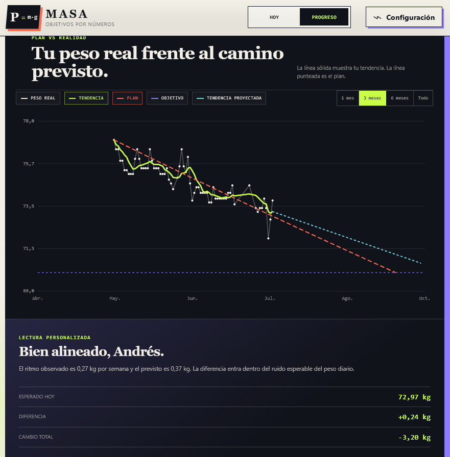

# MASA

> **An engineering-inspired platform that treats body weight as a measurable system rather than a nutrition problem.**

Rather than building another calorie tracker, MASA treats body weight as a measurable system. Nutrition is only one of the inputs used to model energy balance, predict trends and continuously validate whether the underlying mathematical model still represents reality.

**Live Demo:** [https://masaandresgonzalez.netlify.app/](https://andresgonzalez.netlify.app/masa)

## How It's Made

**Tech used:** HTML, CSS, Vanilla JavaScript, Canvas API, LocalStorage

The project was intentionally built without frontend frameworks. My goal was to understand every layer of the application instead of relying on abstractions, while keeping the final bundle lightweight and easy to deploy.

The architecture follows a local-first philosophy. All calculations and user data remain on the device, eliminating the need for authentication, cloud infrastructure or backend services. Besides improving privacy, this forces the application to be deterministic, resilient and fully functional offline.

From the beginning I tried to separate the project into independent pieces: user data, calculation engine and presentation layer. This makes it possible to evolve the mathematical model without constantly rewriting the interface.

Artificial intelligence is also part of the development workflow. Rather than generating application logic, I use LLMs to discuss software architecture, iterate on UX decisions, validate algorithms and challenge design assumptions. The final implementation and every numerical calculation remain deterministic and fully explainable.

## Engineering Approach

The objective is not to predict body weight perfectly, but to build a model that continuously improves as new measurements become available.

Instead of relying on static calorie estimations, the application constantly compares expected and observed results, allowing the underlying model to be recalibrated over time.

Every calculation is deterministic, reproducible and transparent.

## Design Philosophy

A few principles guide every decision made in the project.

- User data belongs to the user.
- Calculations should always be explainable.
- Offline functionality is a feature, not a fallback.
- The interface should reduce friction instead of exposing unnecessary complexity.
- The mathematical model should evolve with new measurements instead of remaining static.

The goal is to create software that helps users understand their own data rather than simply collect it.

## Optimizations

The project intentionally avoids heavyweight frameworks in order to keep the codebase lightweight, understandable and easy to maintain.

Some of the engineering decisions include:

- Local-first architecture.
- Zero backend infrastructure.
- Deterministic calculation engine.
- Modular data model.
- Progressive enhancement instead of framework dependency.
- Responsive interface built from a single codebase.

## Lessons Learned

This project gradually became much more than a health application.

It challenged me to think about software architecture, UX design, statistical modelling and long-term maintainability as a single problem instead of isolated components.

One of the biggest lessons has been learning when AI genuinely improves the development process and when deterministic algorithms are the better solution. Finding that balance has influenced nearly every technical decision made throughout the project.
